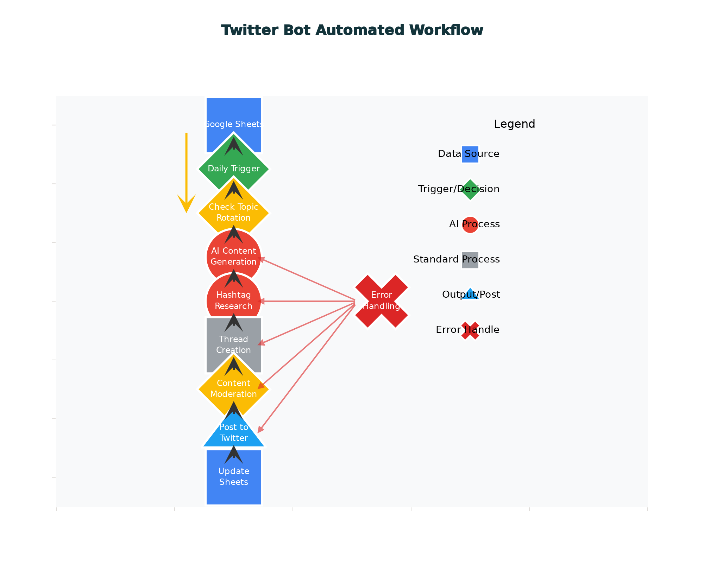
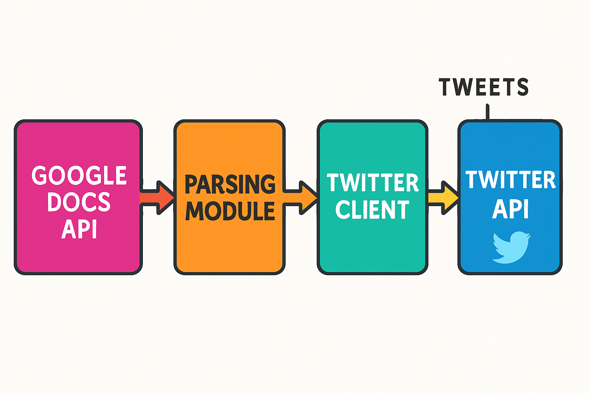
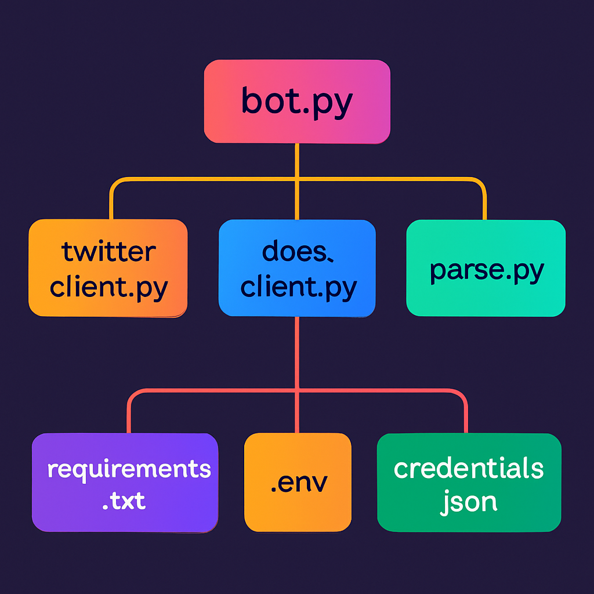
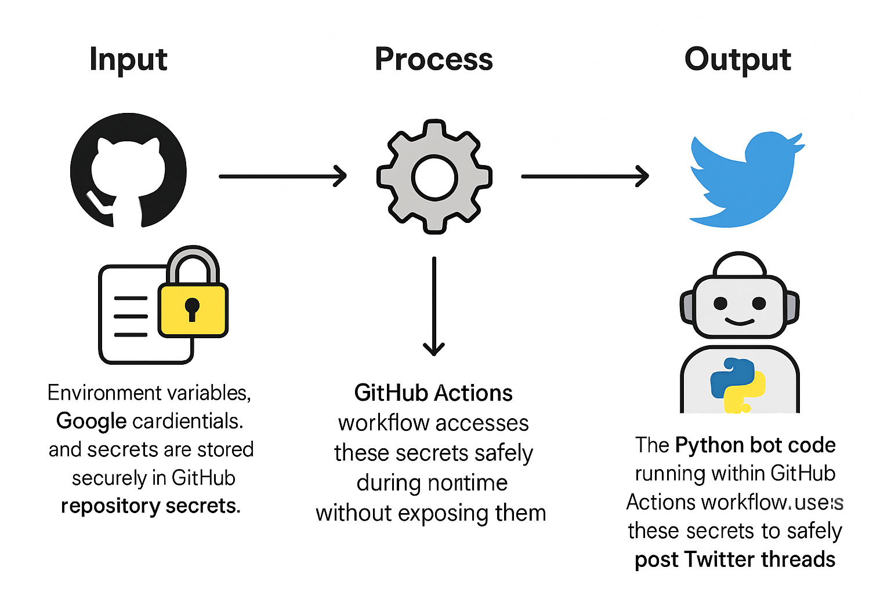

# Twitter Thread Bot — Text-Only Google Doc Poster


A Python bot that posts threaded tweets containing only text and links, sourced from a Google Doc, using Tweepy (OAuth 1.0a) and Google Docs API. Clean, secure, and CI-ready with GitHub Actions.

---

## Features

- Text-only threads from a Google Doc, no media uploads.  
- Simple “Thread:/END” parsing to form sequences.  
- Robust Tweepy posting with reply-chaining.  
- Secure secrets via `.env` locally and GitHub Actions secrets in CI.  
- Clear, minimal project structure ready for extension.

---

## Visual Overview
### Twitter Automated WorkFlow


### Architecture Flow


### Project Skeleton


### GitHub Actions & Secrets


---

## Project Structure
```
twitter-thread-bot/
├── main.py             # Main orchestrator: reads doc, parses threads, posts tweets
├── google_docs_parser.py # Parse Google Doc text into tweet threads
├── twitter_client.py  # Tweepy client: posts tweets & chains replies
├── requirements.txt   # Python dependencies
├── .env               # Environment variables (do not commit)
├── credentials.json   # Google OAuth client (do not commit)
└── .github/
    └── workflows/
        └── twitter-bot.yml # GitHub Actions workflow
```

---

## How It Works

1) parse.py  
- Splits the document into threads using markers:  
  - Start a thread with a line beginning with “Thread:”  
  - End a thread with a line containing “END”  
  - Each non-empty line between markers becomes a tweet in order.

2) twitter_client.py  
- Authenticates using OAuth 1.0a (four tokens from the Developer Portal).  
- Posts the initial tweet; each subsequent tweet replies to the previous one to form a thread.

3) bot.py  
- Loads environment, reads the doc, parses threads, and posts sequentially.

---

## Setup

### Prerequisites

- Python 3.11+  
- Twitter Developer account with Read & Write permissions, OAuth 1.0a keys/tokens  
- Google Cloud project with Google Docs API enabled; OAuth Desktop “credentials.json”

### Install Dependencies
```pip install -r requirements.txt```

### Environment Variables

Create a `.env` file in the project root:

```
DOC_ID=your_gdoc_id
X_BEARER_TOKEN=AAAAAAAAAAAAAAAAAAAAAxxxxxxxxxxxxxxxxxxxxxxxxxxxxxxxxxxxxxxxxxxxxxxxxxxxxxxxxxxxxxxxxxxxxxxxxxxxxxxxxxxxxxxxxx
X_API_KEY=xxxxxxxxxxxxxxxxxxxxxxxxx
X_API_SECRET=xxxxxxxxxxxxxxxxxxxxxxxxxxxxxxxxxxxxxxxxxxxxxxxxx
X_ACCESS_TOKEN=xxxxxxxxxxxxxxxxxxxxxxxxxxxxxxxxxxxxxxxxxxxxxxxx
X_ACCESS_SECRET=xxxxxxxxxxxxxxxxxxxxxxxxxxxxxxxxxxxxxxxxxxxxxxxxx
X_CLIENT_ID=xxxxxxxxxxxxxxxxxxxxxxxxxxxxxxx
X_CLIENT_SECRET=xxxxxxxxxxxxxxxxxxxxxxxxxxxxxxxxxxxxxxxxxxxxxxxx
```

Notes:
- Never commit `.env` or `credentials.json` to public repos.
- Ensure the Twitter App is set to Read + Write under OAuth 1.0a permissions.

---

## Local Run
```python
python main.py
```

First run will open a Google OAuth browser flow; allow access, and a local `token.json` will be saved for subsequent runs. The bot will then parse the Google Doc and post threads, printing tweet IDs and a final link.

---

## Document Format Example

```
Thread: My Launch Notes
Tweet 1 line text with a useful link https://example.com
Tweet 2 line text, more details
END

Thread: Another Update
Point A with link https://example.org
Point B
END
```

- Each “Thread:” starts a new thread.
- “END” completes the current thread.
- Every non-empty line in between is a tweet in the thread, posted in order.

---

## GitHub Actions (CI/CD)

### Add Repository Secrets

In GitHub → Repo → Settings → Secrets and variables → Actions → “New repository secret”:

- `CONSUMER_KEY`  
- `CONSUMER_SECRET`  
- `ACCESS_TOKEN`  
- `ACCESS_SECRET`  
- `DOC_ID`  
- `GOOGLE_CREDENTIALS_BASE64` (Base64-encoded contents of `credentials.json`)

Create the Base64 content locally:

```
base64 credentials.json > credentials.base64
Open credentials.base64 and paste its content into the secret GOOGLE_CREDENTIALS_BASE64
```

## Extending the Bot

- Auto-split long lines > 280 chars in `parse.py`.  
- Add validation for links.  
- Support “draft mode” to print without posting.  
- Maintain a posted log to avoid duplicate postings.

---

## Troubleshooting

- 401 Unauthorized: verify all four OAuth 1.0a tokens and that your app has Read/Write permission.  
- Google consent loop: ensure Docs API is enabled and `credentials.json` is OAuth Desktop type.  
- Empty output: ensure your Google Doc uses the “Thread:” / “END” markers and that `DOC_ID` is correct.

---

## License

GNU GPLv3 © Parv Agarwal
